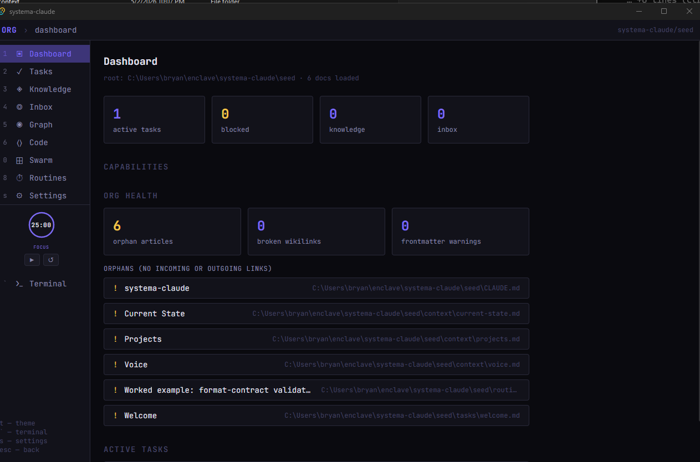

# systema-claude

A local, file-based workspace for working alongside an AI agent. Your files stay on your disk. The agent reads and writes them through the same window you do. Continuity lives in the folder, not in a vendor's memory feature.

Built as a single desktop binary (Tauri + Rust) with a TUI-style document browser, a knowledge graph view, a code editor, a routines runner, and a multi-agent swarm pane. Comes with a small seed workspace, a verification harness for the file conventions it uses, and example configs for Claude and Codex CLIs.

> Status: pre-v0.1.0. The orgd daemon and Tauri app are forked, build cleanly, and run against the bundled seed. Installer (MSI/NSIS) is produced. First public test in progress; rough edges welcome.

---

## Try it

1. **Download** the latest installer from [Releases](https://github.com/bjb2/systema-claude/releases) (Windows, MSI or NSIS).
2. **Install + run.** The first launch opens the bundled seed workspace.
3. **Open `tasks/welcome.md`** and bring your agent of choice (Claude by default; the `claude` CLI from Anthropic must be on your `PATH`). The welcome task is the agent's own onboarding script — it interviews you for ~45 minutes and writes your voice, your projects, and the principles you actually live by into `context/`. You can pause anywhere.

The welcome task is itself a worked example of how the workspace expects you to operate: a file in the substrate, read by the agent, edited collaboratively, validated by a harness, archived when done.

If you'd rather hack on systema-claude itself, clone the repo and read `docs/hacking.md` (TODO).

## What you'll see



A left-rail navigator with Dashboard / Tasks / Knowledge / Inbox / Graph / Code / Swarm / Routines / Settings. The dashboard summarises your active tasks, blocked items, knowledge entries, and inbox; an Org Health panel below flags orphan articles, broken wikilinks, and frontmatter warnings. Tasks shows your task files grouped by project. Knowledge is your distilled-insights library, also grouped by project tag. Graph visualises the wikilink connections between everything in the workspace. Code is a CodeMirror 6 editor that opens any file in the workspace and saves through the daemon. Swarm spawns up to six agent terminals in a slot grid, each with its own working directory and prompt. Routines is a YAML editor + drag-connect Flow editor for the cron-driven background runner.

A right-side terminal toggles open with backtick. A Pomodoro timer lives at the bottom of the sidebar.

Themes cycle with `t`. Search palette is `Ctrl+K`. Most views have keyboard shortcuts (numbers and letters from the sidebar).

The screenshot above is the v0.1.0 build pointed at the bundled seed: 1 active task (the welcome interview), the routines folder shows the format-contract example, and everything is an "orphan" because the seed ships with no inter-document links — that's expected; the user develops the link graph through use.

## Agents

Two example configs ship in `examples/agents/`:

- `claude.json` — default. Uses the `claude` CLI from Anthropic.
- `codex.json` — alternative. Uses the `codex` CLI.

Bring your own: `org.config.json` in the workspace root accepts arbitrary `launchCmd` and `printArgs`. Other agents (Gemini, aider, opencode, cursor-agent, ollama) work fine — we just don't ship configs we haven't personally validated.

## How the pieces fit

Three things ship together:

- **`systema-claude.exe`** — the Tauri desktop shell. The window you interact with.
- **`orgd`** — a local Rust daemon, bundled inside the .exe. It owns the file watcher, the document index, agent process management, the routine runner, and an HTTP+WS API on `127.0.0.1:<ephemeral>` that the shell talks to. You don't run it directly; the shell launches it on startup.
- **The seed workspace** — `CLAUDE.md` + `context/` + empty `tasks/` / `inbox/` / `knowledge/` / `routines/` + `examples/`. The first launch opens this.

The seed is just plain folders on disk. No symlinks, junctions, or special filesystem setup required.

## What systema-claude is *not*

If you've used a few of these and want to know which corner of the design space this lives in:

- **Not a chat interface.** There's no thread. The substrate is files; the agent reads and writes them. Conversation is incidental.
- **Not a coding IDE.** Code editing is included because some files are code; the point is the workspace, not the syntax highlighting.
- **Not a note-taking app with AI bolted on.** The agent is a tenant of the workspace, not a feature button. The architecture assumes the agent will operate on the workspace whether you're watching or not.
- **Not a workflow platform.** Routines exist, but they're standing instructions to the agent — not orchestrated nodes in a DAG product.
- **Not a memory feature.** Continuity lives in the files. If your tools disappeared tomorrow, the workspace would still read linearly.
- **Not a federation client.** Single machine. Architectural hooks are reserved for later, but v1 is just you.
- **Not a stepping stone.** systema-claude is its own school, not preparation for something more articulated. See `docs/charter.md`.

If any of those negations made you think "but I want exactly that thing," pick a different tool. There are good ones.

## The verification harness

The harness is the central feature, in the sense that it's the discipline the project tries to teach by structure. Every contract the workspace ships with — frontmatter schema, routine-step output shape, agent invocation envelope — comes with a tiny test runner next to it. Not crypto-grade; just enough to make a divergence visible to one user before it travels to another user, or to a future you who has forgotten the original assumptions.

The reference implementation is `examples/harness/validate-frontmatter.py`. It walks the workspace and reports any markdown file with missing required frontmatter fields. It self-tests against a pair of valid + invalid fixtures. The pattern (a contract, a passing example, a failing example, a runner) is what you should copy when you write your own contracts.

## Philosophy (one paragraph)

systema-claude is named for the martial art Systema, whose discipline is **principles over prescriptions, effectiveness-checking over technique-collecting**. The seed ships no prescribed routine templates, no prescribed knowledge taxonomy, no prescribed agent configurations. It ships equipment, labeled. You develop your own practice. The harness substitutes for the second pair of eyes a single-user workspace lacks by definition.

Full charter (including why "no graduation path," what disagreement-as-protocol means in practice, and the architecture-inscribes-profile remedies the project tries to follow) is at `docs/charter.md`.

## Build from source

If you'd rather not run an unsigned binary (Windows Defender will flag the download until the project gets a code-signing certificate), build it yourself:

**Prerequisites**

- [Rust toolchain](https://rustup.rs/) (1.77.2 or newer)
- [Node.js](https://nodejs.org/) 18+ and npm
- Windows: WebView2 Runtime — preinstalled on Windows 10 (1803+) and Windows 11; download from Microsoft if missing.
- macOS / Linux: standard Tauri prerequisites — see [Tauri's setup guide](https://v2.tauri.app/start/prerequisites/).

**Clone + build**

```bash
git clone https://github.com/bjb2/systema-claude.git
cd systema-claude/app
npm install
npx tauri build
```

The build runs in two steps: first `cargo build --release` for the orgd sidecar daemon (script: `app/scripts/build-orgd.mjs`), then the Tauri build for the desktop shell. First build takes 5–10 minutes depending on your machine.

**Outputs land at:**

- `app/src-tauri/target/release/systema-claude-app.exe` — the standalone binary you built yourself.
- `app/src-tauri/target/release/bundle/msi/systema-claude_0.1.0_x64_en-US.msi` — your own MSI installer.
- `app/src-tauri/target/release/bundle/nsis/systema-claude_0.1.0_x64-setup.exe` — your own NSIS installer.

The binary you produce is identical to the binary in the published release except for the build timestamp. It is still unsigned (signing requires a code-signing certificate from a CA — outside the scope of this project), but you have full provenance: you built it from the source you can read.

**Run against the bundled seed:**

Copy the built `systema-claude-app.exe` to `seed/` and double-click it (the daemon will pick `seed/` as the workspace because that's where it finds `CLAUDE.md`). Or set `ORG_ROOT` explicitly:

```bash
ORG_ROOT="C:/path/to/your/workspace" ./app/src-tauri/target/release/systema-claude-app.exe
```

**Tests:**

```bash
cd orgd && cargo test    # 26 tests across 8 suites
cd ../app && npx tsc      # frontend type-check
python examples/harness/validate-frontmatter.py seed
python examples/harness/validate-frontmatter.py examples/harness/fixtures/valid    # PASS
python examples/harness/validate-frontmatter.py examples/harness/fixtures/invalid  # FAIL with violation
```

## License

MIT. See `LICENSE`.

## Lineage

Spun off from a private parent workspace authored by Bryan Bartley with Claude Opus 4.7. The parent contains personal content — knowledge, projects, voice work — that does not migrate. systema-claude is the public, no-personal-content distillation: the patterns the parent learned, restated for an audience of one (you).
